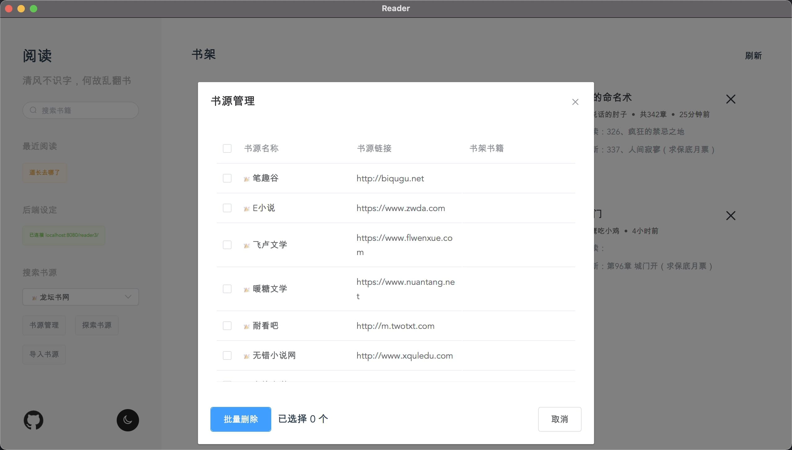
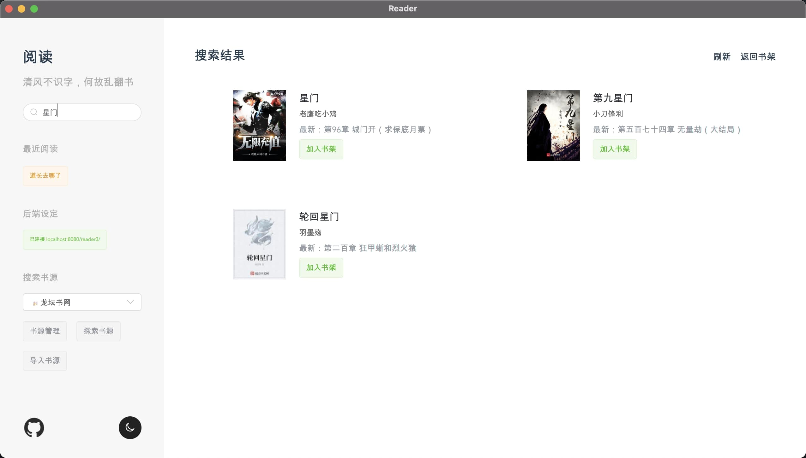
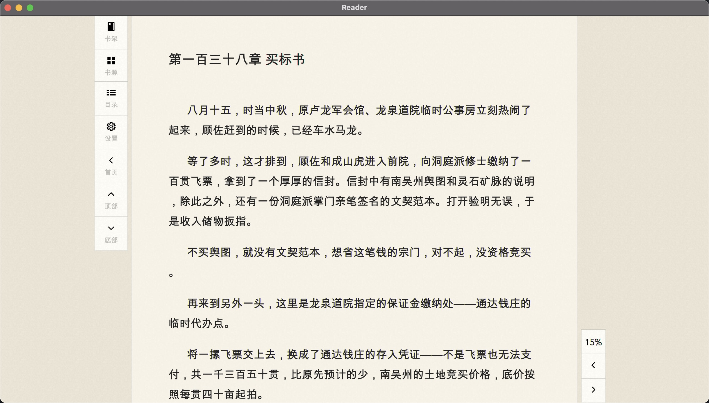
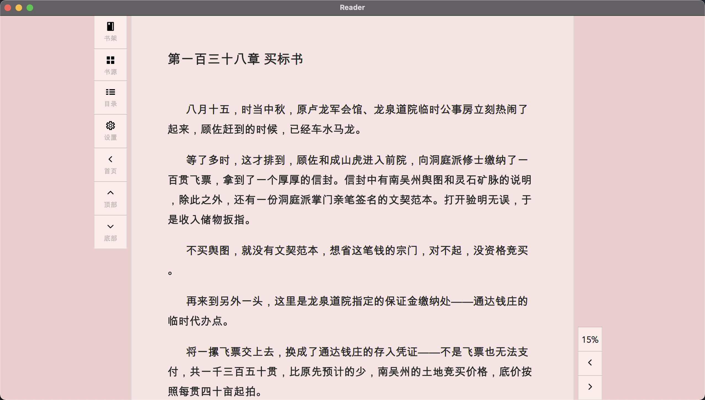

# reader

阅读3网页版(带接口服务，不需要手机)。

接口从 [lightink-server](https://github.com/lightink-qingmo/lightink-server) 修改而来，网页从 [阅读3.0Web端](https://github.com/celetor/web-yuedu3) 修改而来。

在线体验 👉 [https://reader.htmake.com](https://reader.htmake.com)

> Demo 服务器是腾讯云的1M小水管，勿打求饶
>
> 数据不定期清除

## 功能

- 书源管理
- 书架管理
- 搜索
- 书海
- 看书
- 移动端适配
- 换源
- 翻页方式
- 手势支持
- 自定义主题
- 自定义样式

## 预览









## 数据存储

接口服务使用文件存储书源及目录等信息，存储位置为 storage 目录(可通过运行时添加 `-Dreader.app.storagePath=/path/to/storage` 修改)。

> MacOS客户端的存储目录是 `~/.reader/storage`，Window和Linux客户端为 `运行目录/storage`

v1.3.0以上版本数据存储目录结构如下：

> 书籍缓存目录由 `书名` 变为 `书名_作者名`，这个变动需要手动编辑，否则书籍书源列表缓存信息无法使用

```bash
storage
├── assets                                        # 静态资源
│   ├── background                                # 自定义阅读背景图片保存目录
│   │   └── 6.jpg
│   └── reader.css                                # 自定义CSS样式文件
├── cache                                         # 缓存目录
│   ├── 6190ac40068e74c2c82624e91a5f8a0c.jpg      # 书籍封面缓存
│   ├── bookInfoCache.json                        # 书籍搜索缓存Map
│   └── ea11967236129bdae6133c3c9ff8c2dd.jpg
├── data                                          # 数据目录
│   ├── default                                   # 系统默认用户的数据目录 (reader.app.secure为false时)
│   │   ├── bookSource.json                       # 书源列表
│   │   ├── bookshelf.json                        # 书架书籍列表
│   │   ├── 斗罗大陆_唐家三少                        # 书籍缓存目录
│   │   │   ├── 5d01bc88d6b19ebbe974acaac1675811.json    # A书源目录列表
│   │   │   ├── 7e5ca1cc2a1ea2e09fdec4ee2e150f02.json    # B书源目录列表
│   │   │   └── bookSource.json                          # 书籍书源列表
│   ├── hector                                    # 用户 hector 的数据目录 (reader.app.secure为true时的用户目录)
│   │   ├── bookSource.json                       # 书源列表
│   │   ├── bookshelf.json                        # 书架书籍列表
│   │   ├── webdav                                # webdav 存储目录 可能会存在 legado 子目录
│   │   │   ├── backup2021-09-15.zip              # 阅读3备份文件
│   │   │   └── bookProgress                      # 阅读3书籍进度备份目录
│   │   │       └── 斗罗大陆_唐家三少.json           # 阅读3书籍进度
│   │   └── 斗罗大陆_唐家三少                        # 书籍缓存目录
│   │       └── 2d44d0ec2397b6c1d4010b97d914031e.json
│   └── users.json                                # 用户列表
└── windowConfig.json                             # 窗口配置文件
```

v1.3.0及以下旧版目录结构

> 覆盖安装新版后，会自动迁移旧版结构到新版，并在数据目录父目录下保存旧版目录备份 `storage-backup`，如果确认无误，可以自行删除

```bash
storage
├── bookInfoCache.json   # 搜索缓存Map
├── bookSource.json      # 书源列表
├── bookshelf.json       # 书架书籍列表
├── windowConfig.json    # 窗口配置文件
└── 斗罗大陆              # 书籍缓存目录
    ├── 04abb3842aabc03d08a14186be005e89.json # A书源目录列表
    ├── bookSource.json                       # 书籍书源列表
    └── dd82fe35c050e73427a710e9dd6feaf8.json # B书源目录列表
```

### 窗口配置文件

`storage/windowConfig.json`

该文件是图形界面的相关配置，JSON格式，修改后，程序重启才会生效

> 请仔细检查配置内容，不支持注释，此处注释只是为了方便理解

```json
{
    "serverPort": 8080,            // web服务端口，默认为 8080
    "showUI": true,                // 是否显示UI界面，默认为显示
    "debug": false,                // 是否调试模式，默认为否
    "positionX": 0.0,              // 窗口位置 横坐标
    "positionY": 0.0,              // 窗口位置 纵坐标
    "width": 1280.0,               // 窗口大小 宽度
    "height": 800.0,               // 窗口大小 高度
    "rememberSize": true,          // 改变窗口大小时，是否记住窗口大小，默认记住
    "rememberPosition": false,     // 移动窗口时，是否记住窗口位置，默认不记住
    "setWindowPosition": false,    // 启动时是否设置窗口位置，默认不设置，窗口默认居中
    "setWindowSize": true,         // 启动时是否设置窗口大小，默认按照配置文件进行设置
}
```

## 自定义阅读主题

书架页面仅支持白天模式和黑夜模式。

阅读页面支持设置多款主题，还可以自定义主题。自定义阅读主题包括:

- 自定义页面背景颜色
- 自定义浮窗背景颜色
- 自定义阅读背景颜色
- 自定义阅读背景图片

## 自定义样式

页面还会加载应用目录下的 `reader-assets/reader.css` 这个CSS样式文件，在这个文件中可以自定义页面样式。

> 自定义样式可能需要配合 `!important` 来设定属性

## 接口服务配置

```yml
reader:
  app:
    storagePath: storage   # 数据存储目录
    showUI: false          # 是否显示UI
    debug: false           # 是否调试模式
    packaged: false        # 是否打包为客户端
    secure: false          # 是否需要登录鉴权，开启后将支持多用户模式
    inviteCode: ""         # 注册邀请码，为空时则开放注册，否则注册时需要输入邀请码
    secureKey: ""          # 管理密码，开启鉴权时，前端管理用户空间的管理密码

  server:
    port: 8080             # 监听端口
    webUrl: http://localhost:${reader.server.port}    # web链接

```

## 开发编译

### 编译脚本

```bash
$ ./build.sh

USAGE: ./build.sh build|run|win|linux|mac|serve|cli|yarn|web|sync

build   调试打包
run     桌面端编译运行，需要先执行 sync 命令编译同步web资源
win     打包 windows 安装包
linux   打包 linux 安装包
mac     打包 mac 安装包
serve   服务端编译运行
cli     服务端打包命令
yarn    web页面 yarn 快捷命令，默认 install
web     开发web页面
sync    编译同步web资源
```

### 编译前端

```bash
cd web
# 启动开发服务 访问 http://localhost:8081/
# yarn serve

# 编译，并拷贝到 src/main/resources/web 目录
yarn sync
```

### 编译接口

```bash
./gradlew assemble --info

java -jar build/libs/reader-1.4.0.jar

# 指定 storage 路径  默认为相对路径 storage
# java -Dreader.app.storagePath=cacheStorage  -jar build/libs/reader-1.4.0.jar

# web端 http://localhost:8080/
# 接口地址 http://localhost:8080/reader3/
```

## Docker部署

```bash
# 自行编译
# docker build -t reader:latest .
# docker run -d --restart=always --name=reader -v $(PWD)/log:/log -v $(PWD)/storage:/storage -p 8080:8080 reader:latest

# 使用预编译的镜像
docker run -d --restart=always --name=reader -v $(PWD)/log:/log -v $(PWD)/storage:/storage -p 8080:8080 hectorqin/reader

# web端 http://localhost:8080/
# 接口地址 http://localhost:8080/reader3/
```

## 接口文档

与 [阅读3Web接口](https://github.com/gedoor/legado/blob/master/api.md) 基本一致，只是多了接口前缀 `/reader3/`

### 新增接口

#### 加入书架

- URL `http://localhost:8080/reader3/saveBook`
- Method `POST`
- Body `json 格式`

```JSON
{
    "infoHtml": "",
    "tocHtml": "",
    "bookUrl": "https://www.damixs.com/book/dmfz.html",
    "origin": "https://www.damixs.com",
    "originName": "🎉大米小说",
    "type": 0,
    "name": "道门法则",
    "author": "八宝饭",
    "kind": "02-14",
    "intro": "在道门掌控的天下，应该怎么修炼？符箓、丹药、道士、灵妖、斋醮科仪......想要修仙，很好，请从扫厕所开始做起！符诏到来的时候，你需要站在什么位置？Q群：1701556（需验证订阅截图）、954782460“盟主群”",
    "wordCount": "",
    "latestChapterTitle": "番外四（贺消脱止-M荣升盟主）",
    "tocUrl": "",
    "time": 1628756214810,
    "originOrder": 16
}
```

- Response Body

[Book字段参考](https://github.com/gedoor/legado/blob/master/app/src/main/java/io/legado/app/data/entities/Book.kt)

```JSON
{
    "isSuccess": true,
    "errorMsg": "",
    "data": Book
}
```

#### 获取书籍书源

- URL `http://localhost:8080/reader3/getBookSource?url=xxx`
- Method `GET`

获取指定URL对应的书源信息, 和 `阅读3Web接口` 的 `getSource` 接口相同

- Response Body

[SearchBook字段参考](https://github.com/gedoor/legado/blob/master/app/src/main/java/io/legado/app/data/entities/SearchBook.kt)

```JSON
{
    "isSuccess": true,
    "errorMsg": "",
    "data": [SearchBook]
}
```

#### 搜索书籍更多书源

- URL `http://localhost:8080/reader3/searchBookSource?name=xxx&lastIndex=0`
- Method `GET`

搜索指定name对应的书源列表信息

lastIndex 是上次搜索结果中返回的字段，默认为 0，可以传入 `getBookSource` 接口返回的SearchBook列表长度

- Response Body

[SearchBook字段参考](https://github.com/gedoor/legado/blob/master/app/src/main/java/io/legado/app/data/entities/SearchBook.kt)

```JSON
{
    "isSuccess": true,
    "errorMsg": "",
    "data": [SearchBook]
}
```

#### 书籍换源

- URL `http://localhost:8080/reader3/saveBookSource`
- Method `POST`
- Body `json 格式`

```JSON
{
    "newUrl": "新源书籍链接",
    "name": "书籍名称",
    "bookSourceUrl": "书源链接"
}
```

- Response Body

[Book字段参考](https://github.com/gedoor/legado/blob/master/app/src/main/java/io/legado/app/data/entities/Book.kt)

```JSON
{
    "isSuccess": true,
    "errorMsg": "",
    "data": Book
}
```

## TODO

- [x] 定时更新书架书籍章节
- [ ] 多源并发搜索书籍
- [ ] 并发更新书架章节
- [ ] 并发搜索书籍来源
- [x] WebDav同步
- [ ] 导入本地书籍，支持epub

## 感谢

- [lightink-小说API](https://github.com/lightink-qingmo/lightink-server)
- [阅读](https://github.com/gedoor/MyBookshelf)
- [阅读3.0](https://github.com/gedoor/legado)
- [阅读3.0Web端](https://github.com/celetor/web-yuedu3)
