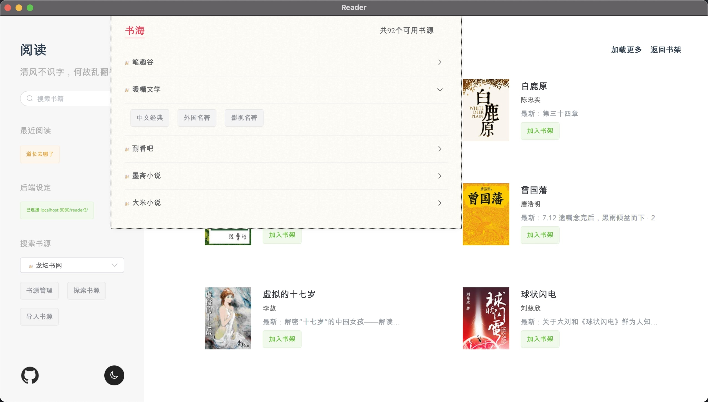
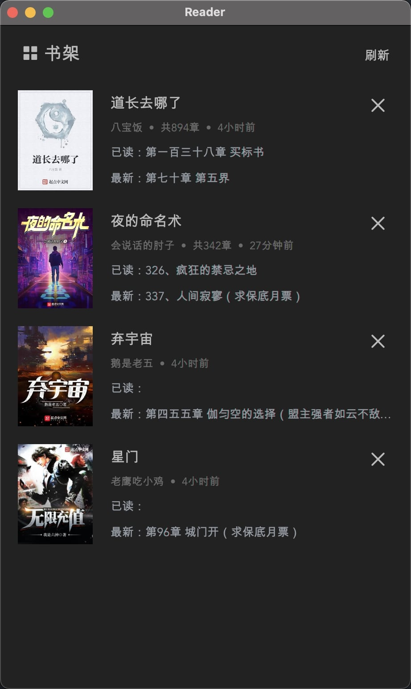

# reader

阅读3网页版(带接口服务，不需要手机)。

接口从 [lightink-server](https://github.com/lightink-qingmo/lightink-server) 修改而来，网页从 [阅读3.0Web端](https://github.com/celetor/web-yuedu3) 修改而来。

## 功能

- 书源管理
- 书架管理
- 搜索
- 书海
- 看书
- 移动端适配
- 换源

## 预览








## 开发编译

### 编译前端

```bash
cd web
# 启动开发服务 访问 http://localhost:8081/
# yarn serve

# 编译，并拷贝到 src/main/resources/web 目录
yarn sync
```

### 编译接口

```bash
./gradlew assemble --info

java -jar build/libs/reader-1.0.0.jar

# 指定 storage 路径  默认为相对路径 storage
# java -Dreader.app.storagePath=cacheStorage  -jar build/libs/reader-1.0.0.jar

# web端 http://localhost:8080/web/
# 接口地址 http://localhost:8080/reader3/
```

## Docker部署

```bash
# 自行编译
# docker build -t reader:latest .
# docker run -d --restart=always --name=reader -v $(PWD)/log:/log -v $(PWD)/storage:/storage -p 8080:8080 reader:latest

# 使用预编译的镜像
docker run -d --restart=always --name=reader -v $(PWD)/log:/log -v $(PWD)/storage:/storage -p 8080:8080 hectorqin/reader

# web端 http://localhost:8080/web/
# 接口地址 http://localhost:8080/reader3/
```

## 数据存储

接口服务使用文件存储书源及目录等信息，存储位置为 storage 目录(可通过运行时添加 `-Dreader.app.storagePath=/path/to/storage` 修改)，目录结构如下：

```bash
storage
├── bookInfoCache.json   # 搜索缓存Map
├── bookSource.json      # 书源列表
├── bookshelf.json       # 书架书籍列表
└── 斗罗大陆              # 书籍缓存目录
    ├── 04abb3842aabc03d08a14186be005e89.json # A书源目录列表
    ├── bookSource.json                       # 书籍书源列表
    └── dd82fe35c050e73427a710e9dd6feaf8.json # B书源目录列表
```

## 接口文档

与 [阅读3Web接口](https://github.com/gedoor/legado/blob/master/api.md) 基本一致，只是多了接口前缀 `/reader3/`

### 新增接口

#### 加入书架

- URL `http://localhost:8080/reader3/saveBook`
- Method `POST`
- Body `json 格式`

```JSON
{
    "infoHtml": "",
    "tocHtml": "",
    "bookUrl": "https://www.damixs.com/book/dmfz.html",
    "origin": "https://www.damixs.com",
    "originName": "🎉大米小说",
    "type": 0,
    "name": "道门法则",
    "author": "八宝饭",
    "kind": "02-14",
    "intro": "在道门掌控的天下，应该怎么修炼？符箓、丹药、道士、灵妖、斋醮科仪......想要修仙，很好，请从扫厕所开始做起！符诏到来的时候，你需要站在什么位置？Q群：1701556（需验证订阅截图）、954782460“盟主群”",
    "wordCount": "",
    "latestChapterTitle": "番外四（贺消脱止-M荣升盟主）",
    "tocUrl": "",
    "time": 1628756214810,
    "originOrder": 16
}
```

- Response Body

[Book字段参考](https://github.com/gedoor/legado/blob/master/app/src/main/java/io/legado/app/data/entities/Book.kt)

```JSON
{
    "isSuccess": true,
    "errorMsg": "",
    "data": Book
}
```

#### 获取书籍书源

- URL `http://localhost:8080/reader3/getBookSource?url=xxx`
- Method `GET`

获取指定URL对应的书源信息, 和 `阅读3Web接口` 的 `getSource` 接口相同

- Response Body

[SearchBook字段参考](https://github.com/gedoor/legado/blob/master/app/src/main/java/io/legado/app/data/entities/SearchBook.kt)

```JSON
{
    "isSuccess": true,
    "errorMsg": "",
    "data": [SearchBook]
}
```

#### 搜索书籍更多书源

- URL `http://localhost:8080/reader3/searchBookSource?name=xxx&lastIndex=0`
- Method `GET`

搜索指定name对应的书源列表信息

lastIndex 是上次搜索结果中返回的字段，默认为 0，可以传入 `getBookSource` 接口返回的SearchBook列表长度

- Response Body

[SearchBook字段参考](https://github.com/gedoor/legado/blob/master/app/src/main/java/io/legado/app/data/entities/SearchBook.kt)

```JSON
{
    "isSuccess": true,
    "errorMsg": "",
    "data": [SearchBook]
}
```

#### 书籍换源

- URL `http://localhost:8080/reader3/saveBookSource`
- Method `POST`
- Body `json 格式`

```JSON
{
    "newUrl": "新源书籍链接",
    "name": "书籍名称",
    "bookSourceUrl": "书源链接"
}
```

- Response Body

[Book字段参考](https://github.com/gedoor/legado/blob/master/app/src/main/java/io/legado/app/data/entities/Book.kt)

```JSON
{
    "isSuccess": true,
    "errorMsg": "",
    "data": Book
}
```

## TODO

- [ ] 多源并发搜索书籍
- [ ] 并发更新书架章节
- [ ] 并发搜索书籍来源
- [ ] 定时更新书架书籍章节

## 感谢

- [lightink-小说API](https://github.com/lightink-qingmo/lightink-server)
- [阅读](https://github.com/gedoor/MyBookshelf)
- [阅读3.0](https://github.com/gedoor/legado)
- [阅读3.0Web端](https://github.com/celetor/web-yuedu3)
